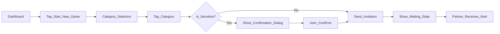
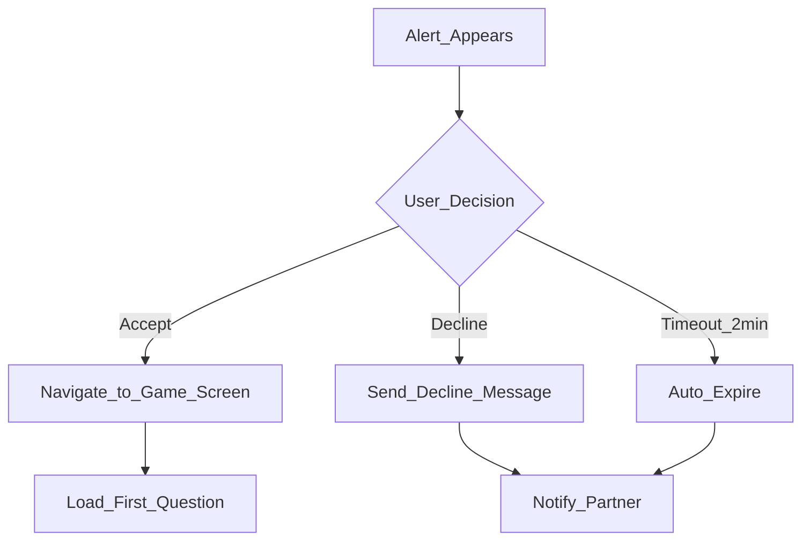
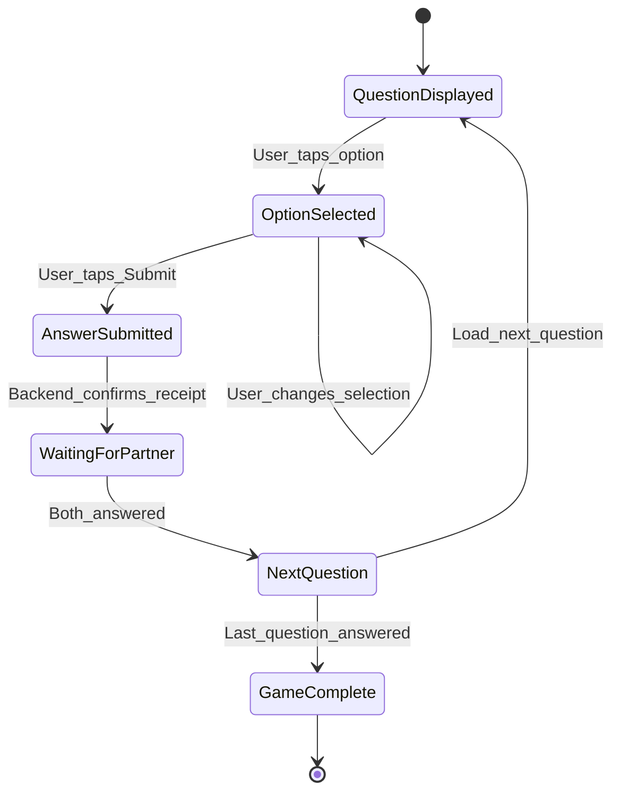
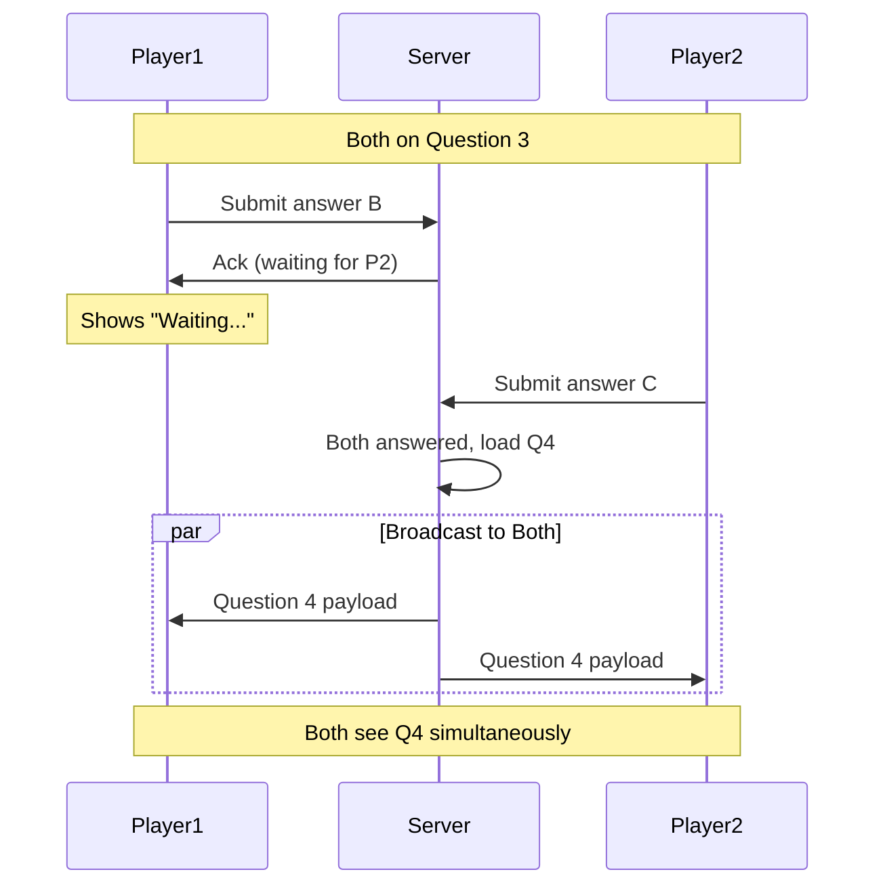
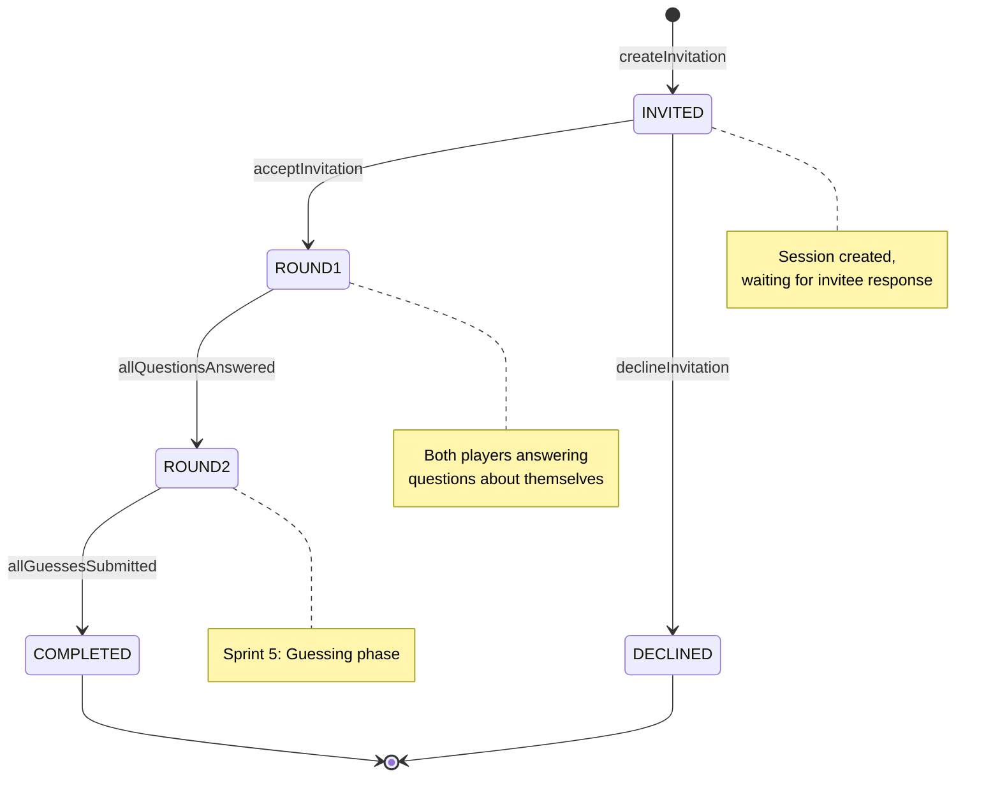
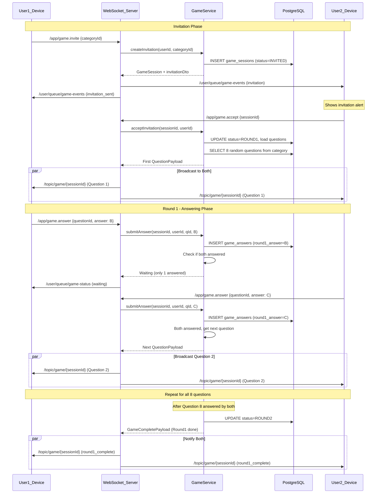
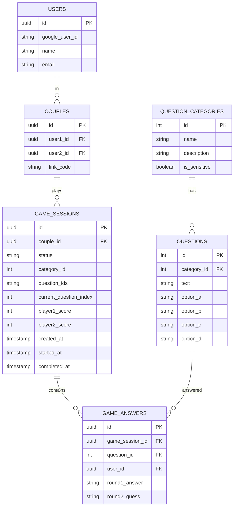
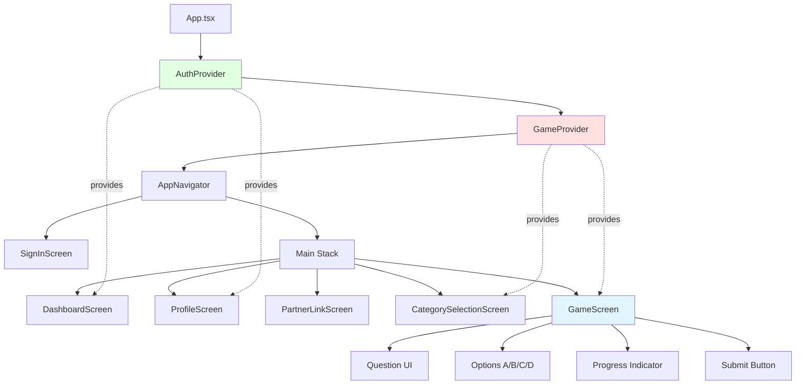

# Sprint 4 Implementation PRD: Core Gameplay - Round 1 (Answering)

## Document Status: READY FOR IMPLEMENTATION

**Last Updated**: February 4, 2026  
**Sprint Duration**: 2 weeks (10 working days)  
**Priority**: P0 (Blocks MVP)  
**Author**: Product & Engineering Team  
**Stakeholders**: Full Team

---

## Executive Summary

### Feature Overview
Sprint 4 implements the core gameplay experience for "Only Yours" - a real-time, synchronized multiplayer question-answering game where couples learn about each other. This sprint focuses on **Round 1: Answering**, where both players answer questions about themselves, setting the foundation for Round 2 (guessing) in Sprint 5.

### User Value Proposition
- **Asynchronous-Free Experience**: Both players progress through questions together in real-time
- **Connection Building**: Couples learn surprising facts about each other
- **Low-Pressure Fun**: Multiple choice format removes performance anxiety
- **Synchronized Journey**: Players wait for each other, reinforcing partnership

### Technical Approach
- **WebSocket-Based Real-Time Messaging**: STOMP protocol over WebSocket for bidirectional communication
- **Stateful Game Sessions**: Database-backed game state persists across reconnections
- **Event-Driven Architecture**: Backend broadcasts events to keep clients synchronized
- **Optimistic UI Updates**: Frontend shows immediate feedback while awaiting server confirmation

### Success Criteria
- ✅ Two physical devices can complete a full 8-question game session
- ✅ Questions appear simultaneously on both devices (< 500ms latency)
- ✅ Game state persists if app backgrounds briefly
- ✅ Graceful handling of network interruptions
- ✅ Zero data loss (all answers recorded correctly)

### Timeline & Dependencies
- **Prerequisites**: React Native 0.75.4 upgrade complete ✅ ([`RN_UPGRADE_PRD.md`](RN_UPGRADE_PRD.md))
- **Foundation**: Sprint 3 WebSocket infrastructure ✅ ([`SPRINT_3_IMPLEMENTATION.md`](SPRINT_3_IMPLEMENTATION.md))
- **Duration**: 2 weeks (9-13 days estimated)
- **Next Sprint**: Sprint 5 (Round 2 - Guessing & Results)

---

## Table of Contents

1. [User Stories & Acceptance Criteria](#1-user-stories--acceptance-criteria)
2. [Technical Architecture](#2-technical-architecture)
3. [Backend Implementation Specification](#3-backend-implementation-specification)
4. [Frontend Implementation Specification](#4-frontend-implementation-specification)
5. [API & WebSocket Contract](#5-api--websocket-contract)
6. [Database Schema & Repository Layer](#6-database-schema--repository-layer)
7. [Testing Strategy](#7-testing-strategy)
8. [Error Handling & Edge Cases](#8-error-handling--edge-cases)
9. [Success Criteria & Acceptance Gates](#9-success-criteria--acceptance-gates)
10. [Out of Scope](#10-out-of-scope)
11. [Timeline & Effort Breakdown](#11-timeline--effort-breakdown)
12. [Risk Assessment](#12-risk-assessment)

---

## 1. User Stories & Acceptance Criteria

### Story 1: Game Invitation

**As a user**  
I want to invite my partner to play a game in a selected category  
**So that** we can start a synchronized game session together

**Acceptance Criteria**:
- [ ] After selecting a category on the Category Selection screen, I can initiate an invitation
- [ ] My partner receives the invitation in real-time within 2 seconds
- [ ] Invitation displays:
  - My name (the inviter)
  - Category name and description
  - Accept and Decline buttons
- [ ] If my partner declines, I receive a notification
- [ ] If my partner accepts, both of us navigate to the Game screen simultaneously
- [ ] Only one invitation can be active at a time per couple

**User Flow**:


### Story 2: Game Acceptance

**As a user**  
I want to accept or decline a game invitation from my partner  
**So that** we can start playing together or politely decline

**Acceptance Criteria**:
- [ ] I see a modal/alert immediately when an invitation arrives (even if app is open on another screen)
- [ ] Modal shows:
  - Partner's name
  - Category name and icon/image
  - "Accept Game" button (primary)
  - "Decline" button (secondary)
- [ ] Tapping "Accept" navigates both players to the Game screen
- [ ] Tapping "Decline" dismisses the modal and notifies the inviter
- [ ] If I don't respond within 2 minutes, the invitation auto-expires
- [ ] I cannot accept if I'm already in an active game

**User Flow**:


### Story 3: Question Display

**As a player**  
I want to see questions one at a time with multiple choice options  
**So that** I can answer questions about myself thoughtfully

**Acceptance Criteria**:
- [ ] Question text is displayed clearly at the top of the screen
- [ ] Four answer options (A, B, C, D) are shown as tappable cards
- [ ] Question number and total count are visible (e.g., "Question 3 of 8")
- [ ] Progress bar shows completion percentage
- [ ] Each option has:
  - Letter label (A, B, C, D)
  - Full option text
  - Clear visual indication when selected
- [ ] Question remains on screen until BOTH players have answered
- [ ] No "skip" or "back" buttons (forward-only progression)

**UI Mockup Concepts**:
- Clean, centered layout with ample whitespace
- Large, readable typography (18-20pt for question, 16pt for options)
- Color-coded selections (highlighted border/background)
- Smooth transitions between questions

### Story 4: Answer Submission

**As a player**  
I want to submit my answer and wait for my partner  
**So that** we progress through questions together synchronously

**Acceptance Criteria**:
- [ ] I can select exactly one answer option at a time
- [ ] Tapping an option highlights it and enables the "Submit" button
- [ ] Tapping a different option changes my selection (not submitted until I tap Submit)
- [ ] After tapping "Submit":
  - My selected answer is locked in (cannot change)
  - Submit button is disabled
  - A "Waiting for [Partner Name]..." message appears
  - My selection remains visually highlighted
- [ ] When both players have submitted, the next question appears within 1 second
- [ ] If connection is lost, my answer is still recorded (when reconnected)

**State Machine**:


### Story 5: Game Synchronization

**As a player**  
I want the game to stay synchronized with my partner  
**So that** we experience the game together in real-time

**Acceptance Criteria**:
- [ ] Both players see the same question at the same time (< 500ms latency)
- [ ] Neither player can skip ahead or go back
- [ ] If one player loses connection:
  - Other player sees "Partner disconnected" indicator
  - Game pauses (no timeout penalty)
  - On reconnection, game resumes from current question
- [ ] If app is backgrounded for < 5 minutes, game state persists
- [ ] If app is backgrounded for > 5 minutes, session expires gracefully
- [ ] Real-time status indicator shows:
  - "Both connected" (green)
  - "Connecting..." (yellow)
  - "Partner disconnected" (orange)

**Synchronization Flow**:


---

## 2. Technical Architecture

### 2.1 System Architecture Diagram

```mermaid
graph TB
    subgraph Frontend[React Native Frontend]
        UI[GameScreen UI]
        GC[GameContext State]
        WS[WebSocketService]
        UI -->|User Actions| GC
        GC -->|Send Messages| WS
        WS -->|Receive Events| GC
        GC -->|Update UI| UI
    end

    subgraph Backend[Spring Boot Backend]
        WSController[GameController WebSocket]
        GameService[GameService Business Logic]
        SessionRepo[GameSessionRepository]
        AnswerRepo[GameAnswerRepository]
        QuestionRepo[QuestionRepository]
        
        WSController -->|Calls| GameService
        GameService -->|Queries| SessionRepo
        GameService -->|Queries| AnswerRepo
        GameService -->|Queries| QuestionRepo
    end

    subgraph Database[(PostgreSQL)]
        GSTable[game_sessions]
        GATable[game_answers]
        QTable[questions]
    end

    WS <-->|STOMP/WebSocket| WSController
    SessionRepo --> GSTable
    AnswerRepo --> GATable
    QuestionRepo --> QTable
```

### 2.2 Game Session State Machine



### 2.3 Message Flow Sequence



### 2.4 Technology Stack

| Layer | Technology | Version | Purpose |
|-------|-----------|---------|---------|
| **Frontend** | React Native | 0.75.4 | Mobile UI framework |
| | React | 18.3.1 | Component library |
| | React Navigation | 7.1.18 | Screen navigation |
| | STOMP.js | 7.0.0 | WebSocket client protocol |
| | SockJS | 1.6.1 | WebSocket fallback |
| **Backend** | Spring Boot | 3.5.x | Java web framework |
| | Spring WebSocket | 3.5.x | WebSocket support |
| | STOMP | 2.3.x | Messaging protocol |
| | Spring Data JPA | 3.5.x | Database ORM |
| **Database** | PostgreSQL | 14+ | Relational database |
| **Communication** | WebSocket/STOMP | - | Real-time bidirectional messaging |

---

## 3. Backend Implementation Specification

### 3.1 Data Transfer Objects (DTOs)

Create new DTOs in `backend/src/main/java/com/onlyyours/dto/`:

#### GameInvitationDto.java

```java
package com.onlyyours.dto;

import lombok.AllArgsConstructor;
import lombok.Builder;
import lombok.Data;
import lombok.NoArgsConstructor;

import java.util.UUID;

@Data
@Builder
@NoArgsConstructor
@AllArgsConstructor
public class GameInvitationDto {
    private String type = "INVITATION";  // Message type
    private UUID sessionId;
    private UUID categoryId;
    private String categoryName;
    private String categoryDescription;
    private Boolean isSensitive;
    private UUID inviterId;
    private String inviterName;
    private Long timestamp;  // Unix timestamp in milliseconds
}
```

**Usage**: Sent to partner's private queue when game is initiated

#### QuestionPayloadDto.java

```java
package com.onlyyours.dto;

import lombok.AllArgsConstructor;
import lombok.Builder;
import lombok.Data;
import lombok.NoArgsConstructor;

import java.util.UUID;

@Data
@Builder
@NoArgsConstructor
@AllArgsConstructor
public class QuestionPayloadDto {
    private String type = "QUESTION";
    private UUID sessionId;
    private Integer questionId;
    private Integer questionNumber;  // 1-based (1, 2, 3...)
    private Integer totalQuestions;  // e.g., 8
    private String questionText;
    private String optionA;
    private String optionB;
    private String optionC;
    private String optionD;
    private String round;  // "ROUND1" or "ROUND2"
}
```

**Usage**: Broadcast to both players on game topic

#### AnswerRequestDto.java

```java
package com.onlyyours.dto;

import lombok.AllArgsConstructor;
import lombok.Data;
import lombok.NoArgsConstructor;

import java.util.UUID;

@Data
@NoArgsConstructor
@AllArgsConstructor
public class AnswerRequestDto {
    private UUID sessionId;
    private Integer questionId;
    private String answer;  // "A", "B", "C", or "D"
}
```

**Usage**: Received from clients when they submit an answer

**Validation**:
```java
import javax.validation.constraints.*;

@NotNull(message = "Session ID is required")
private UUID sessionId;

@NotNull(message = "Question ID is required")
private Integer questionId;

@NotNull(message = "Answer is required")
@Pattern(regexp = "^[A-D]$", message = "Answer must be A, B, C, or D")
private String answer;
```

#### GameStatusDto.java

```java
package com.onlyyours.dto;

import lombok.AllArgsConstructor;
import lombok.Builder;
import lombok.Data;
import lombok.NoArgsConstructor;

import java.util.UUID;

@Data
@Builder
@NoArgsConstructor
@AllArgsConstructor
public class GameStatusDto {
    private String type = "STATUS";
    private UUID sessionId;
    private String status;  // "WAITING", "BOTH_ANSWERED", "ROUND1_COMPLETE"
    private String message;  // User-friendly message
}
```

**Usage**: Sent to individual player queues for status updates

#### InvitationResponseDto.java

```java
package com.onlyyours.dto;

import lombok.AllArgsConstructor;
import lombok.Data;
import lombok.NoArgsConstructor;

import java.util.UUID;

@Data
@NoArgsConstructor
@AllArgsConstructor
public class InvitationResponseDto {
    private UUID sessionId;
    private Boolean accepted;  // true = accept, false = decline
}
```

**Usage**: Sent when partner responds to invitation

### 3.2 Game Service Implementation

Create `backend/src/main/java/com/onlyyours/service/GameService.java`:

```java
package com.onlyyours.service;

import com.onlyyours.dto.*;
import com.onlyyours.model.*;
import com.onlyyours.repository.*;
import lombok.RequiredArgsConstructor;
import lombok.extern.slf4j.Slf4j;
import org.springframework.stereotype.Service;
import org.springframework.transaction.annotation.Transactional;

import java.util.*;
import java.util.stream.Collectors;

@Service
@Slf4j
@RequiredArgsConstructor
public class GameService {

    private final GameSessionRepository gameSessionRepository;
    private final GameAnswerRepository gameAnswerRepository;
    private final QuestionRepository questionRepository;
    private final QuestionCategoryRepository categoryRepository;
    private final UserRepository userRepository;
    private final CoupleRepository coupleRepository;

    private static final int QUESTIONS_PER_GAME = 8;

    /**
     * Creates a new game invitation
     * 
     * @param inviterId User ID of the person initiating the game
     * @param categoryId Category to use for questions
     * @return GameInvitationDto to be sent to partner
     * @throws IllegalStateException if user not in a couple
     * @throws IllegalArgumentException if category doesn't exist
     */
    @Transactional
    public GameInvitationDto createInvitation(UUID inviterId, UUID categoryId) {
        log.info("Creating game invitation: inviter={}, category={}", inviterId, categoryId);

        // Validate user is in a couple
        User inviter = userRepository.findById(inviterId)
                .orElseThrow(() -> new IllegalArgumentException("User not found"));
        
        Couple couple = coupleRepository.findByUser1_IdOrUser2_Id(inviterId, inviterId)
                .orElseThrow(() -> new IllegalStateException("User must be in a couple to play"));

        // Validate category exists
        QuestionCategory category = categoryRepository.findById(categoryId.intValue())
                .orElseThrow(() -> new IllegalArgumentException("Category not found"));

        // Create game session
        GameSession session = new GameSession();
        session.setId(UUID.randomUUID());
        session.setCouple(couple);
        session.setStatus("INVITED");
        session.setCreatedAt(new Date());
        session.setCategoryId(categoryId.intValue());  // Store for later use

        gameSessionRepository.save(session);

        log.info("Game session created: sessionId={}", session.getId());

        // Build invitation DTO
        return GameInvitationDto.builder()
                .sessionId(session.getId())
                .categoryId(categoryId)
                .categoryName(category.getName())
                .categoryDescription(category.getDescription())
                .isSensitive(category.getIsSensitive())
                .inviterId(inviterId)
                .inviterName(inviter.getName())
                .timestamp(System.currentTimeMillis())
                .build();
    }

    /**
     * Accepts a game invitation and starts Round 1
     * 
     * @param sessionId Game session ID
     * @param accepterId User ID of the person accepting
     * @return First question to display
     * @throws IllegalStateException if session not in INVITED state
     */
    @Transactional
    public QuestionPayloadDto acceptInvitation(UUID sessionId, UUID accepterId) {
        log.info("Accepting invitation: sessionId={}, accepter={}", sessionId, accepterId);

        // Load session
        GameSession session = gameSessionRepository.findById(sessionId)
                .orElseThrow(() -> new IllegalArgumentException("Game session not found"));

        if (!"INVITED".equals(session.getStatus())) {
            throw new IllegalStateException("Game is not in INVITED state");
        }

        // Validate accepter is the partner
        Couple couple = session.getCouple();
        UUID partnerId = couple.getUser1().getId().equals(accepterId) 
                ? couple.getUser2().getId() 
                : couple.getUser1().getId();

        // Load questions for the category
        List<Question> allQuestions = questionRepository.findByCategoryId(session.getCategoryId());
        
        if (allQuestions.size() < QUESTIONS_PER_GAME) {
            throw new IllegalStateException("Not enough questions in category");
        }

        // Randomly select questions
        Collections.shuffle(allQuestions);
        List<Question> selectedQuestions = allQuestions.stream()
                .limit(QUESTIONS_PER_GAME)
                .collect(Collectors.toList());

        // Store question IDs in session (JSON array or comma-separated)
        String questionIds = selectedQuestions.stream()
                .map(q -> q.getId().toString())
                .collect(Collectors.joining(","));
        session.setQuestionIds(questionIds);  // Add this field to GameSession entity
        session.setCurrentQuestionIndex(0);
        session.setStatus("ROUND1");
        session.setStartedAt(new Date());

        gameSessionRepository.save(session);

        log.info("Game started: sessionId={}, questions={}", sessionId, questionIds);

        // Return first question
        return buildQuestionPayload(session, selectedQuestions.get(0), 1);
    }

    /**
     * Declines a game invitation
     */
    @Transactional
    public void declineInvitation(UUID sessionId, UUID declinerId) {
        log.info("Declining invitation: sessionId={}, decliner={}", sessionId, declinerId);

        GameSession session = gameSessionRepository.findById(sessionId)
                .orElseThrow(() -> new IllegalArgumentException("Game session not found"));

        session.setStatus("DECLINED");
        gameSessionRepository.save(session);
    }

    /**
     * Submits an answer for a player
     * 
     * @return Optional<QuestionPayloadDto> - present if both answered (next question)
     */
    @Transactional
    public Optional<QuestionPayloadDto> submitAnswer(
            UUID sessionId, 
            UUID userId, 
            Integer questionId, 
            String answer) {
        
        log.info("Submitting answer: session={}, user={}, question={}, answer={}", 
                sessionId, userId, questionId, answer);

        // Validate answer format
        if (!answer.matches("^[A-D]$")) {
            throw new IllegalArgumentException("Answer must be A, B, C, or D");
        }

        // Load session
        GameSession session = gameSessionRepository.findById(sessionId)
                .orElseThrow(() -> new IllegalArgumentException("Game session not found"));

        if (!"ROUND1".equals(session.getStatus())) {
            throw new IllegalStateException("Game is not in ROUND1 state");
        }

        // Check if answer already exists (idempotency)
        Optional<GameAnswer> existing = gameAnswerRepository
                .findByGameSessionIdAndQuestionIdAndUserId(sessionId, questionId, userId);

        if (existing.isPresent()) {
            log.warn("Answer already recorded for user, ignoring duplicate");
            return Optional.empty();  // Already answered, no next question
        }

        // Record answer
        GameAnswer gameAnswer = new GameAnswer();
        gameAnswer.setId(UUID.randomUUID());
        gameAnswer.setGameSession(session);
        gameAnswer.setQuestionId(questionId);
        gameAnswer.setUserId(userId);
        gameAnswer.setRound1Answer(answer);

        gameAnswerRepository.save(gameAnswer);

        // Check if both players have answered
        long answerCount = gameAnswerRepository.countByGameSessionIdAndQuestionId(sessionId, questionId);

        if (answerCount >= 2) {
            // Both answered, advance to next question
            log.info("Both players answered, advancing to next question");

            int currentIndex = session.getCurrentQuestionIndex();
            int nextIndex = currentIndex + 1;

            if (nextIndex >= QUESTIONS_PER_GAME) {
                // Round 1 complete
                log.info("Round 1 complete for session {}", sessionId);
                session.setStatus("ROUND2");
                session.setCurrentQuestionIndex(0);  // Reset for Round 2
                gameSessionRepository.save(session);
                return Optional.empty();  // Signal Round 1 complete
            }

            // Load next question
            String[] questionIdsArray = session.getQuestionIds().split(",");
            Integer nextQuestionId = Integer.parseInt(questionIdsArray[nextIndex]);
            Question nextQuestion = questionRepository.findById(nextQuestionId)
                    .orElseThrow(() -> new IllegalStateException("Question not found"));

            session.setCurrentQuestionIndex(nextIndex);
            gameSessionRepository.save(session);

            return Optional.of(buildQuestionPayload(session, nextQuestion, nextIndex + 1));
        }

        // Only one player answered, wait for partner
        return Optional.empty();
    }

    /**
     * Checks if both players have answered a question
     */
    public boolean areBothPlayersAnswered(UUID sessionId, Integer questionId) {
        long count = gameAnswerRepository.countByGameSessionIdAndQuestionId(sessionId, questionId);
        return count >= 2;
    }

    /**
     * Gets current game session state
     */
    public GameSession getGameSession(UUID sessionId) {
        return gameSessionRepository.findById(sessionId)
                .orElseThrow(() -> new IllegalArgumentException("Game session not found"));
    }

    /**
     * Builds a QuestionPayloadDto from a Question entity
     */
    private QuestionPayloadDto buildQuestionPayload(GameSession session, Question question, int questionNumber) {
        return QuestionPayloadDto.builder()
                .sessionId(session.getId())
                .questionId(question.getId())
                .questionNumber(questionNumber)
                .totalQuestions(QUESTIONS_PER_GAME)
                .questionText(question.getText())
                .optionA(question.getOptionA())
                .optionB(question.getOptionB())
                .optionC(question.getOptionC())
                .optionD(question.getOptionD())
                .round("ROUND1")
                .build();
    }
}
```

**Key Design Decisions**:

1. **Idempotency**: `submitAnswer` checks if answer already exists (handles duplicate submissions)
2. **Transactional**: All methods use `@Transactional` to ensure data consistency
3. **Question Selection**: Random shuffle ensures variety in each game
4. **State Validation**: Explicit status checks prevent invalid state transitions
5. **Logging**: Comprehensive logging for debugging and monitoring

### 3.3 Game WebSocket Controller

Create `backend/src/main/java/com/onlyyours/controller/GameController.java`:

```java
package com.onlyyours.controller;

import com.onlyyours.dto.*;
import com.onlyyours.model.Couple;
import com.onlyyours.model.User;
import com.onlyyours.repository.CoupleRepository;
import com.onlyyours.repository.UserRepository;
import com.onlyyours.service.GameService;
import lombok.RequiredArgsConstructor;
import lombok.extern.slf4j.Slf4j;
import org.springframework.messaging.handler.annotation.MessageMapping;
import org.springframework.messaging.handler.annotation.Payload;
import org.springframework.messaging.simp.SimpMessagingTemplate;
import org.springframework.stereotype.Controller;

import java.security.Principal;
import java.util.Optional;
import java.util.UUID;

@Controller
@Slf4j
@RequiredArgsConstructor
public class GameController {

    private final GameService gameService;
    private final SimpMessagingTemplate messagingTemplate;
    private final UserRepository userRepository;
    private final CoupleRepository coupleRepository;

    /**
     * Handles game invitation requests
     * 
     * Message: /app/game.invite
     * Payload: { "categoryId": "uuid-string" }
     * 
     * Sends invitation to partner's private queue
     */
    @MessageMapping("/game.invite")
    public void handleInvitation(@Payload Map<String, String> payload, Principal principal) {
        try {
            String categoryIdStr = payload.get("categoryId");
            UUID categoryId = UUID.fromString(categoryIdStr);

            // Get inviter user
            String inviterEmail = principal.getName();
            User inviter = userRepository.findByEmail(inviterEmail)
                    .orElseThrow(() -> new IllegalArgumentException("User not found"));

            // Create invitation
            GameInvitationDto invitation = gameService.createInvitation(inviter.getId(), categoryId);

            // Get partner
            Couple couple = coupleRepository.findByUser1_IdOrUser2_Id(inviter.getId(), inviter.getId())
                    .orElseThrow(() -> new IllegalStateException("User not in a couple"));

            User partner = couple.getUser1().getId().equals(inviter.getId()) 
                    ? couple.getUser2() 
                    : couple.getUser1();

            // Send invitation to partner's private queue
            messagingTemplate.convertAndSendToUser(
                    partner.getEmail(),
                    "/queue/game-events",
                    invitation
            );

            // Send confirmation to inviter
            messagingTemplate.convertAndSendToUser(
                    inviterEmail,
                    "/queue/game-events",
                    GameStatusDto.builder()
                            .sessionId(invitation.getSessionId())
                            .status("INVITATION_SENT")
                            .message("Invitation sent to " + partner.getName())
                            .build()
            );

            log.info("Invitation sent: session={}, to={}", 
                    invitation.getSessionId(), partner.getEmail());

        } catch (Exception e) {
            log.error("Error handling invitation", e);
            sendErrorToUser(principal.getName(), "Failed to send invitation: " + e.getMessage());
        }
    }

    /**
     * Handles game acceptance
     * 
     * Message: /app/game.accept
     * Payload: { "sessionId": "uuid-string" }
     * 
     * Starts the game and broadcasts first question
     */
    @MessageMapping("/game.accept")
    public void handleAcceptance(@Payload Map<String, String> payload, Principal principal) {
        try {
            String sessionIdStr = payload.get("sessionId");
            UUID sessionId = UUID.fromString(sessionIdStr);

            // Get accepter user
            String accepterEmail = principal.getName();
            User accepter = userRepository.findByEmail(accepterEmail)
                    .orElseThrow(() -> new IllegalArgumentException("User not found"));

            // Accept invitation and get first question
            QuestionPayloadDto firstQuestion = gameService.acceptInvitation(sessionId, accepter.getId());

            // Broadcast first question to both players on game topic
            String gameTopic = "/topic/game/" + sessionId;
            messagingTemplate.convertAndSend(gameTopic, firstQuestion);

            log.info("Game started: session={}, question={}", sessionId, firstQuestion.getQuestionNumber());

        } catch (Exception e) {
            log.error("Error accepting invitation", e);
            sendErrorToUser(principal.getName(), "Failed to accept game: " + e.getMessage());
        }
    }

    /**
     * Handles game decline
     * 
     * Message: /app/game.decline
     * Payload: { "sessionId": "uuid-string" }
     */
    @MessageMapping("/game.decline")
    public void handleDecline(@Payload Map<String, String> payload, Principal principal) {
        try {
            String sessionIdStr = payload.get("sessionId");
            UUID sessionId = UUID.fromString(sessionIdStr);

            // Get decliner user
            String declinerEmail = principal.getName();
            User decliner = userRepository.findByEmail(declinerEmail)
                    .orElseThrow(() -> new IllegalArgumentException("User not found"));

            // Decline invitation
            gameService.declineInvitation(sessionId, decliner.getId());

            // Notify inviter
            // (Would need to store inviter ID in session or retrieve from couple)
            Couple couple = coupleRepository.findByUser1_IdOrUser2_Id(decliner.getId(), decliner.getId())
                    .orElseThrow(() -> new IllegalStateException("User not in a couple"));

            User partner = couple.getUser1().getId().equals(decliner.getId()) 
                    ? couple.getUser2() 
                    : couple.getUser1();

            messagingTemplate.convertAndSendToUser(
                    partner.getEmail(),
                    "/queue/game-events",
                    GameStatusDto.builder()
                            .sessionId(sessionId)
                            .status("INVITATION_DECLINED")
                            .message(decliner.getName() + " declined the invitation")
                            .build()
            );

            log.info("Game declined: session={}, by={}", sessionId, declinerEmail);

        } catch (Exception e) {
            log.error("Error declining invitation", e);
            sendErrorToUser(principal.getName(), "Failed to decline: " + e.getMessage());
        }
    }

    /**
     * Handles answer submission
     * 
     * Message: /app/game.answer
     * Payload: { "sessionId": "uuid", "questionId": 42, "answer": "B" }
     * 
     * If both answered, broadcasts next question
     */
    @MessageMapping("/game.answer")
    public void handleAnswer(@Payload AnswerRequestDto request, Principal principal) {
        try {
            // Get user
            String userEmail = principal.getName();
            User user = userRepository.findByEmail(userEmail)
                    .orElseThrow(() -> new IllegalArgumentException("User not found"));

            // Submit answer
            Optional<QuestionPayloadDto> nextQuestion = gameService.submitAnswer(
                    request.getSessionId(),
                    user.getId(),
                    request.getQuestionId(),
                    request.getAnswer()
            );

            // Send confirmation to this player
            messagingTemplate.convertAndSendToUser(
                    userEmail,
                    "/queue/game-status",
                    GameStatusDto.builder()
                            .sessionId(request.getSessionId())
                            .status("ANSWER_RECORDED")
                            .message("Waiting for partner...")
                            .build()
            );

            // If both answered, broadcast next question
            if (nextQuestion.isPresent()) {
                String gameTopic = "/topic/game/" + request.getSessionId();
                messagingTemplate.convertAndSend(gameTopic, nextQuestion.get());

                log.info("Next question broadcasted: session={}, question={}", 
                        request.getSessionId(), nextQuestion.get().getQuestionNumber());
            } else {
                // Check if Round 1 is complete
                var session = gameService.getGameSession(request.getSessionId());
                if ("ROUND2".equals(session.getStatus())) {
                    // Round 1 complete, notify both players
                    String gameTopic = "/topic/game/" + request.getSessionId();
                    messagingTemplate.convertAndSend(
                            gameTopic,
                            GameStatusDto.builder()
                                    .sessionId(request.getSessionId())
                                    .status("ROUND1_COMPLETE")
                                    .message("Round 1 complete! Proceeding to Round 2...")
                                    .build()
                    );
                    log.info("Round 1 complete: session={}", request.getSessionId());
                }
            }

        } catch (Exception e) {
            log.error("Error handling answer", e);
            sendErrorToUser(principal.getName(), "Failed to submit answer: " + e.getMessage());
        }
    }

    /**
     * Helper method to send error messages to a user's private queue
     */
    private void sendErrorToUser(String userEmail, String errorMessage) {
        messagingTemplate.convertAndSendToUser(
                userEmail,
                "/queue/errors",
                Map.of(
                        "type", "ERROR",
                        "message", errorMessage,
                        "timestamp", System.currentTimeMillis()
                )
        );
    }
}
```

**Key Features**:

1. **Private Queues**: Uses `/user/queue/*` for player-specific messages
2. **Broadcast Topics**: Uses `/topic/game/{sessionId}` for synchronized events
3. **Error Handling**: Comprehensive try-catch with user-facing error messages
4. **Principal Authentication**: Extracts user from STOMP principal (set by JWT security)
5. **Idempotent Operations**: Service layer handles duplicate submissions

---

## 4. Frontend Implementation Specification

### 4.1 Global Game State (GameContext)

Create `OnlyYoursApp/src/state/GameContext.js`:

```javascript
import React, { createContext, useContext, useState, useEffect } from 'react';
import WebSocketService from '../services/WebSocketService';
import { Alert } from 'react-native';

const GameContext = createContext();

export const useGame = () => {
  const context = useContext(GameContext);
  if (!context) {
    throw new Error('useGame must be used within GameProvider');
  }
  return context;
};

export const GameProvider = ({ children }) => {
  const [activeSession, setActiveSession] = useState(null);
  const [currentQuestion, setCurrentQuestion] = useState(null);
  const [myAnswer, setMyAnswer] = useState(null);
  const [waitingForPartner, setWaitingForPartner] = useState(false);
  const [gameStatus, setGameStatus] = useState(null); // 'playing', 'waiting', 'complete'
  const [subscription, setSubscription] = useState(null);

  // Start a new game session
  const startGame = (sessionId) => {
    console.log('[GameContext] Starting game:', sessionId);
    setActiveSession(sessionId);
    setGameStatus('playing');
    
    // Subscribe to game topic
    const gameTopic = `/topic/game/${sessionId}`;
    const sub = WebSocketService.subscribe(gameTopic, (message) => {
      const payload = JSON.parse(message.body);
      console.log('[GameContext] Received:', payload);
      
      if (payload.type === 'QUESTION') {
        // New question arrived
        setCurrentQuestion(payload);
        setMyAnswer(null);
        setWaitingForPartner(false);
      } else if (payload.type === 'STATUS' && payload.status === 'ROUND1_COMPLETE') {
        // Round 1 finished
        setGameStatus('complete');
        Alert.alert(
          'Round 1 Complete!',
          'Great job! Round 2 coming soon...',
          [{ text: 'OK' }]
        );
      }
    });
    
    setSubscription(sub);
  };

  // Submit an answer
  const submitAnswer = (answer) => {
    if (!activeSession || !currentQuestion) {
      console.error('[GameContext] No active session or question');
      return;
    }

    console.log('[GameContext] Submitting answer:', answer);
    setMyAnswer(answer);
    setWaitingForPartner(true);

    // Send to backend
    WebSocketService.sendMessage('/app/game.answer', {
      sessionId: activeSession,
      questionId: currentQuestion.questionId,
      answer: answer,
    });
  };

  // End game session
  const endGame = () => {
    console.log('[GameContext] Ending game');
    if (subscription) {
      subscription.unsubscribe();
    }
    setActiveSession(null);
    setCurrentQuestion(null);
    setMyAnswer(null);
    setWaitingForPartner(false);
    setGameStatus(null);
    setSubscription(null);
  };

  // Cleanup on unmount
  useEffect(() => {
    return () => {
      if (subscription) {
        subscription.unsubscribe();
      }
    };
  }, [subscription]);

  const value = {
    activeSession,
    currentQuestion,
    myAnswer,
    waitingForPartner,
    gameStatus,
    startGame,
    submitAnswer,
    endGame,
  };

  return <GameContext.Provider value={value}>{children}</GameContext.Provider>;
};
```

**Integration**: Wrap in `App.tsx`:

```javascript
import { GameProvider } from './src/state/GameContext';

// Inside App component
<AuthProvider>
  <GameProvider>
    <AppNavigator />
  </GameProvider>
</AuthProvider>
```

### 4.2 Dashboard Screen Updates

Update `OnlyYoursApp/src/screens/DashboardScreen.js`:

```javascript
import React, { useEffect, useState } from 'react';
import { View, Text, StyleSheet, TouchableOpacity, Alert } from 'react-native';
import { useAuth } from '../state/AuthContext';
import api from '../services/api';

const DashboardScreen = ({ navigation }) => {
  const { user } = useAuth();
  const [couple, setCouple] = useState(null);
  const [loading, setLoading] = useState(true);

  useEffect(() => {
    loadCoupleStatus();
  }, []);

  const loadCoupleStatus = async () => {
    try {
      const response = await api.get('/api/couple');
      setCouple(response.data);
    } catch (error) {
      if (error.response?.status === 404) {
        // Not linked yet
        setCouple(null);
      } else {
        Alert.alert('Error', 'Failed to load couple status');
      }
    } finally {
      setLoading(false);
    }
  };

  const handleStartGame = () => {
    if (!couple) {
      Alert.alert('Link Required', 'Please link with your partner first to play games.');
      navigation.navigate('PartnerLink');
      return;
    }
    navigation.navigate('CategorySelection');
  };

  if (loading) {
    return (
      <View style={styles.container}>
        <Text>Loading...</Text>
      </View>
    );
  }

  return (
    <View style={styles.container}>
      <Text style={styles.title}>Welcome, {user?.name}!</Text>

      {couple ? (
        <>
          <Text style={styles.subtitle}>
            Connected with {couple.user1.id === user.id ? couple.user2.name : couple.user1.name}
          </Text>

          <TouchableOpacity style={styles.primaryButton} onPress={handleStartGame}>
            <Text style={styles.buttonText}>Start New Game</Text>
          </TouchableOpacity>
        </>
      ) : (
        <>
          <Text style={styles.subtitle}>Not linked with a partner yet</Text>

          <TouchableOpacity
            style={styles.secondaryButton}
            onPress={() => navigation.navigate('PartnerLink')}>
            <Text style={styles.buttonText}>Link with Partner</Text>
          </TouchableOpacity>
        </>
      )}

      <TouchableOpacity
        style={styles.tertiaryButton}
        onPress={() => navigation.navigate('Profile')}>
        <Text style={styles.linkText}>View Profile</Text>
      </TouchableOpacity>
    </View>
  );
};

const styles = StyleSheet.create({
  container: {
    flex: 1,
    justifyContent: 'center',
    alignItems: 'center',
    padding: 20,
    backgroundColor: '#f5f5f5',
  },
  title: {
    fontSize: 28,
    fontWeight: 'bold',
    marginBottom: 10,
    color: '#333',
  },
  subtitle: {
    fontSize: 18,
    marginBottom: 30,
    color: '#666',
    textAlign: 'center',
  },
  primaryButton: {
    backgroundColor: '#6200ea',
    paddingHorizontal: 40,
    paddingVertical: 15,
    borderRadius: 25,
    marginBottom: 15,
    minWidth: 250,
    alignItems: 'center',
  },
  secondaryButton: {
    backgroundColor: '#03dac6',
    paddingHorizontal: 40,
    paddingVertical: 15,
    borderRadius: 25,
    marginBottom: 15,
    minWidth: 250,
    alignItems: 'center',
  },
  tertiaryButton: {
    marginTop: 20,
  },
  buttonText: {
    color: '#fff',
    fontSize: 18,
    fontWeight: '600',
  },
  linkText: {
    color: '#6200ea',
    fontSize: 16,
    textDecorationLine: 'underline',
  },
});

export default DashboardScreen;
```

### 4.3 Category Selection Screen Updates

Update `OnlyYoursApp/src/screens/CategorySelectionScreen.js`:

```javascript
import React, { useEffect, useState } from 'react';
import {
  View,
  Text,
  StyleSheet,
  FlatList,
  TouchableOpacity,
  Alert,
  ActivityIndicator,
} from 'react';
import api from '../services/api';
import WebSocketService from '../services/WebSocketService';
import { useGame } from '../state/GameContext';

const CategorySelectionScreen = ({ navigation }) => {
  const [categories, setCategories] = useState([]);
  const [loading, setLoading] = useState(true);
  const { startGame } = useGame();

  useEffect(() => {
    loadCategories();
  }, []);

  const loadCategories = async () => {
    try {
      const response = await api.get('/api/content/categories');
      setCategories(response.data);
    } catch (error) {
      Alert.alert('Error', 'Failed to load categories');
    } finally {
      setLoading(false);
    }
  };

  const handleCategorySelect = (category) => {
    if (category.sensitive) {
      Alert.alert(
        'Sensitive Content',
        `${category.name} contains mature topics. Continue?`,
        [
          { text: 'Cancel', style: 'cancel' },
          { text: 'Continue', onPress: () => sendInvitation(category) },
        ]
      );
    } else {
      sendInvitation(category);
    }
  };

  const sendInvitation = (category) => {
    console.log('[CategorySelection] Sending invitation for:', category.name);

    // Send invitation via WebSocket
    WebSocketService.sendMessage('/app/game.invite', {
      categoryId: category.id.toString(),
    });

    // Show waiting state
    Alert.alert(
      'Invitation Sent',
      `Waiting for your partner to accept...`,
      [{ text: 'Cancel', onPress: () => navigation.goBack() }]
    );
  };

  const renderCategory = ({ item }) => (
    <TouchableOpacity
      style={[styles.categoryCard, item.sensitive && styles.sensitiveCard]}
      onPress={() => handleCategorySelect(item)}>
      <Text style={styles.categoryName}>{item.name}</Text>
      <Text style={styles.categoryDescription}>{item.description}</Text>
      {item.sensitive && (
        <Text style={styles.sensitiveLabel}>Mature Content</Text>
      )}
    </TouchableOpacity>
  );

  if (loading) {
    return (
      <View style={styles.centered}>
        <ActivityIndicator size="large" color="#6200ea" />
      </View>
    );
  }

  return (
    <View style={styles.container}>
      <Text style={styles.title}>Select a Category</Text>
      <FlatList
        data={categories}
        renderItem={renderCategory}
        keyExtractor={item => item.id.toString()}
        contentContainerStyle={styles.listContent}
      />
    </View>
  );
};

const styles = StyleSheet.create({
  container: {
    flex: 1,
    backgroundColor: '#f5f5f5',
  },
  centered: {
    flex: 1,
    justifyContent: 'center',
    alignItems: 'center',
  },
  title: {
    fontSize: 24,
    fontWeight: 'bold',
    padding: 20,
    color: '#333',
  },
  listContent: {
    padding: 15,
  },
  categoryCard: {
    backgroundColor: '#fff',
    borderRadius: 12,
    padding: 20,
    marginBottom: 15,
    elevation: 2,
    shadowColor: '#000',
    shadowOffset: { width: 0, height: 2 },
    shadowOpacity: 0.1,
    shadowRadius: 4,
  },
  sensitiveCard: {
    borderWidth: 2,
    borderColor: '#ff6f00',
  },
  categoryName: {
    fontSize: 20,
    fontWeight: '600',
    color: '#333',
    marginBottom: 8,
  },
  categoryDescription: {
    fontSize: 14,
    color: '#666',
    lineHeight: 20,
  },
  sensitiveLabel: {
    marginTop: 10,
    fontSize: 12,
    color: '#ff6f00',
    fontWeight: '600',
  },
});

export default CategorySelectionScreen;
```

### 4.4 Invitation Handling (in AuthContext or Dedicated Listener)

Update `OnlyYoursApp/src/state/AuthContext.js` to add invitation listener:

```javascript
// Inside AuthProvider component, after WebSocket connects:

useEffect(() => {
  if (isLoggedIn && userToken) {
    // Connect WebSocket
    WebSocketService.connect('http://localhost:8080', userToken);

    // Subscribe to game invitations
    const invitationSub = WebSocketService.subscribe('/user/queue/game-events', (message) => {
      const payload = JSON.parse(message.body);
      console.log('[Auth] Game event received:', payload);

      if (payload.type === 'INVITATION') {
        handleInvitation(payload);
      } else if (payload.type === 'STATUS') {
        // Handle status updates (e.g., invitation declined)
        if (payload.status === 'INVITATION_DECLINED') {
          Alert.alert('Invitation Declined', payload.message);
        }
      }
    });

    return () => {
      invitationSub?.unsubscribe();
      WebSocketService.disconnect();
    };
  }
}, [isLoggedIn, userToken]);

const handleInvitation = (invitation) => {
  Alert.alert(
    `Game Invitation from ${invitation.inviterName}`,
    `Category: ${invitation.categoryName}\n${invitation.categoryDescription}`,
    [
      {
        text: 'Decline',
        style: 'cancel',
        onPress: () => {
          WebSocketService.sendMessage('/app/game.decline', {
            sessionId: invitation.sessionId,
          });
        },
      },
      {
        text: 'Accept',
        onPress: () => {
          WebSocketService.sendMessage('/app/game.accept', {
            sessionId: invitation.sessionId,
          });
          
          // Start game in GameContext
          const { startGame } = useGame();  // Note: Need to access via ref or callback
          startGame(invitation.sessionId);
          
          // Navigate to Game screen
          // Note: Need navigation ref for this
          navigationRef.current?.navigate('Game', { sessionId: invitation.sessionId });
        },
      },
    ]
  );
};
```

**Alternative**: Create dedicated `GameInvitationListener` component

### 4.5 Game Screen (NEW)

Create `OnlyYoursApp/src/screens/GameScreen.js`:

```javascript
import React, { useEffect, useState } from 'react';
import {
  View,
  Text,
  StyleSheet,
  TouchableOpacity,
  ActivityIndicator,
  Alert,
} from 'react-native';
import { useGame } from '../state/GameContext';

const GameScreen = ({ route, navigation }) => {
  const { sessionId } = route.params;
  const { currentQuestion, myAnswer, waitingForPartner, submitAnswer, gameStatus } = useGame();
  const [selectedOption, setSelectedOption] = useState(null);

  useEffect(() => {
    if (gameStatus === 'complete') {
      Alert.alert(
        'Round 1 Complete!',
        'Get ready for Round 2...',
        [{ text: 'OK', onPress: () => navigation.navigate('Dashboard') }]
      );
    }
  }, [gameStatus]);

  const handleOptionSelect = (option) => {
    if (waitingForPartner || myAnswer) {
      return; // Already submitted
    }
    setSelectedOption(option);
  };

  const handleSubmit = () => {
    if (!selectedOption) {
      Alert.alert('Select an Answer', 'Please select an option before submitting.');
      return;
    }

    submitAnswer(selectedOption);
  };

  const renderOption = (letter, text) => {
    const isSelected = selectedOption === letter;
    const isMyAnswer = myAnswer === letter;
    const isDisabled = waitingForPartner || myAnswer;

    return (
      <TouchableOpacity
        key={letter}
        style={[
          styles.optionCard,
          isSelected && styles.selectedOption,
          isMyAnswer && styles.submittedOption,
          isDisabled && styles.disabledOption,
        ]}
        onPress={() => handleOptionSelect(letter)}
        disabled={isDisabled}>
        <View style={styles.optionLetter}>
          <Text style={styles.optionLetterText}>{letter}</Text>
        </View>
        <Text style={styles.optionText}>{text}</Text>
      </TouchableOpacity>
    );
  };

  if (!currentQuestion) {
    return (
      <View style={styles.centered}>
        <ActivityIndicator size="large" color="#6200ea" />
        <Text style={styles.loadingText}>Loading question...</Text>
      </View>
    );
  }

  return (
    <View style={styles.container}>
      {/* Header */}
      <View style={styles.header}>
        <Text style={styles.questionNumber}>
          Question {currentQuestion.questionNumber} of {currentQuestion.totalQuestions}
        </Text>
        <View style={styles.progressBar}>
          <View
            style={[
              styles.progressFill,
              {
                width: `${(currentQuestion.questionNumber / currentQuestion.totalQuestions) * 100}%`,
              },
            ]}
          />
        </View>
      </View>

      {/* Question */}
      <View style={styles.questionContainer}>
        <Text style={styles.questionText}>{currentQuestion.questionText}</Text>
      </View>

      {/* Options */}
      <View style={styles.optionsContainer}>
        {renderOption('A', currentQuestion.optionA)}
        {renderOption('B', currentQuestion.optionB)}
        {renderOption('C', currentQuestion.optionC)}
        {renderOption('D', currentQuestion.optionD)}
      </View>

      {/* Submit / Waiting */}
      <View style={styles.footer}>
        {waitingForPartner ? (
          <View style={styles.waitingContainer}>
            <ActivityIndicator size="small" color="#6200ea" />
            <Text style={styles.waitingText}>Waiting for partner...</Text>
          </View>
        ) : myAnswer ? (
          <Text style={styles.waitingText}>Answer submitted</Text>
        ) : (
          <TouchableOpacity
            style={[
              styles.submitButton,
              !selectedOption && styles.submitButtonDisabled,
            ]}
            onPress={handleSubmit}
            disabled={!selectedOption}>
            <Text style={styles.submitButtonText}>Submit Answer</Text>
          </TouchableOpacity>
        )}
      </View>
    </View>
  );
};

const styles = StyleSheet.create({
  container: {
    flex: 1,
    backgroundColor: '#f5f5f5',
    padding: 20,
  },
  centered: {
    flex: 1,
    justifyContent: 'center',
    alignItems: 'center',
  },
  loadingText: {
    marginTop: 10,
    fontSize: 16,
    color: '#666',
  },
  header: {
    marginBottom: 20,
  },
  questionNumber: {
    fontSize: 16,
    fontWeight: '600',
    color: '#6200ea',
    marginBottom: 10,
  },
  progressBar: {
    height: 8,
    backgroundColor: '#e0e0e0',
    borderRadius: 4,
    overflow: 'hidden',
  },
  progressFill: {
    height: '100%',
    backgroundColor: '#6200ea',
  },
  questionContainer: {
    backgroundColor: '#fff',
    borderRadius: 12,
    padding: 20,
    marginBottom: 25,
    elevation: 2,
  },
  questionText: {
    fontSize: 20,
    fontWeight: '600',
    color: '#333',
    lineHeight: 28,
    textAlign: 'center',
  },
  optionsContainer: {
    flex: 1,
  },
  optionCard: {
    flexDirection: 'row',
    alignItems: 'center',
    backgroundColor: '#fff',
    borderRadius: 12,
    padding: 15,
    marginBottom: 12,
    borderWidth: 2,
    borderColor: '#e0e0e0',
  },
  selectedOption: {
    borderColor: '#6200ea',
    backgroundColor: '#f3e5f5',
  },
  submittedOption: {
    borderColor: '#03dac6',
    backgroundColor: '#e0f7fa',
  },
  disabledOption: {
    opacity: 0.6,
  },
  optionLetter: {
    width: 36,
    height: 36,
    borderRadius: 18,
    backgroundColor: '#6200ea',
    justifyContent: 'center',
    alignItems: 'center',
    marginRight: 15,
  },
  optionLetterText: {
    color: '#fff',
    fontSize: 18,
    fontWeight: 'bold',
  },
  optionText: {
    flex: 1,
    fontSize: 16,
    color: '#333',
  },
  footer: {
    paddingTop: 20,
  },
  submitButton: {
    backgroundColor: '#6200ea',
    paddingVertical: 16,
    borderRadius: 25,
    alignItems: 'center',
  },
  submitButtonDisabled: {
    backgroundColor: '#b0b0b0',
  },
  submitButtonText: {
    color: '#fff',
    fontSize: 18,
    fontWeight: '600',
  },
  waitingContainer: {
    flexDirection: 'row',
    justifyContent: 'center',
    alignItems: 'center',
    paddingVertical: 16,
  },
  waitingText: {
    fontSize: 16,
    color: '#666',
    marginLeft: 10,
    textAlign: 'center',
  },
});

export default GameScreen;
```

### 4.6 Navigation Updates

Update `OnlyYoursApp/src/navigation/AppNavigator.js`:

```javascript
import React from 'react';
import { NavigationContainer } from '@react-navigation/native';
import { createStackNavigator } from '@react-navigation/stack';

import SignInScreen from '../screens/SignInScreen';
import DashboardScreen from '../screens/DashboardScreen';
import ProfileScreen from '../screens/ProfileScreen';
import PartnerLinkScreen from '../screens/PartnerLinkScreen';
import CategorySelectionScreen from '../screens/CategorySelectionScreen';
import GameScreen from '../screens/GameScreen';  // NEW

import { useAuth } from '../state/AuthContext';

const Stack = createStackNavigator();

const AppNavigator = () => {
  const { isLoggedIn } = useAuth();

  return (
    <NavigationContainer>
      <Stack.Navigator>
        {!isLoggedIn ? (
          <Stack.Screen
            name="SignIn"
            component={SignInScreen}
            options={{ headerShown: false }}
          />
        ) : (
          <>
            <Stack.Screen
              name="Dashboard"
              component={DashboardScreen}
              options={{ title: 'Only Yours' }}
            />
            <Stack.Screen
              name="Profile"
              component={ProfileScreen}
              options={{ title: 'My Profile' }}
            />
            <Stack.Screen
              name="PartnerLink"
              component={PartnerLinkScreen}
              options={{ title: 'Link with Partner' }}
            />
            <Stack.Screen
              name="CategorySelection"
              component={CategorySelectionScreen}
              options={{ title: 'Select Category' }}
            />
            <Stack.Screen
              name="Game"
              component={GameScreen}
              options={{ 
                title: 'Game',
                headerLeft: null,  // Prevent back navigation during game
                gestureEnabled: false,
              }}
            />
          </>
        )}
      </Stack.Navigator>
    </NavigationContainer>
  );
};

export default AppNavigator;
```

---

## 5. API & WebSocket Contract

### 5.1 WebSocket Message Formats

#### Client → Server Messages

**1. Game Invitation**

Endpoint: `/app/game.invite`

```json
{
  "categoryId": "1"
}
```

**2. Accept Invitation**

Endpoint: `/app/game.accept`

```json
{
  "sessionId": "550e8400-e29b-41d4-a716-446655440000"
}
```

**3. Decline Invitation**

Endpoint: `/app/game.decline`

```json
{
  "sessionId": "550e8400-e29b-41d4-a716-446655440000"
}
```

**4. Submit Answer**

Endpoint: `/app/game.answer`

```json
{
  "sessionId": "550e8400-e29b-41d4-a716-446655440000",
  "questionId": 42,
  "answer": "B"
}
```

#### Server → Client Messages

**1. Invitation Notification**

Topic: `/user/queue/game-events`

```json
{
  "type": "INVITATION",
  "sessionId": "550e8400-e29b-41d4-a716-446655440000",
  "categoryId": "1",
  "categoryName": "Getting to Know You",
  "categoryDescription": "Learn basic facts about each other",
  "isSensitive": false,
  "inviterId": "user-uuid",
  "inviterName": "John Doe",
  "timestamp": 1709577600000
}
```

**2. Question Broadcast**

Topic: `/topic/game/{sessionId}`

```json
{
  "type": "QUESTION",
  "sessionId": "550e8400-e29b-41d4-a716-446655440000",
  "questionId": 42,
  "questionNumber": 3,
  "totalQuestions": 8,
  "questionText": "What is your favorite season?",
  "optionA": "Spring",
  "optionB": "Summer",
  "optionC": "Fall",
  "optionD": "Winter",
  "round": "ROUND1"
}
```

**3. Game Status Update**

Topic: `/user/queue/game-status` (private) or `/topic/game/{sessionId}` (broadcast)

```json
{
  "type": "STATUS",
  "sessionId": "550e8400-e29b-41d4-a716-446655440000",
  "status": "WAITING" | "BOTH_ANSWERED" | "ROUND1_COMPLETE",
  "message": "Waiting for partner..."
}
```

**4. Error Message**

Topic: `/user/queue/errors`

```json
{
  "type": "ERROR",
  "message": "Failed to submit answer: Invalid answer format",
  "timestamp": 1709577600000
}
```

### 5.2 REST API Endpoints (Existing)

Used for initial data loading and non-game operations:

| Method | Endpoint | Purpose |
|--------|----------|---------|
| GET | `/api/content/categories` | Load categories for selection |
| GET | `/api/user/me` | Get current user profile |
| GET | `/api/couple` | Get couple link status |
| POST | `/api/couple/generate-code` | Generate partner link code |
| POST | `/api/couple/link` | Redeem partner link code |

---

## 6. Database Schema & Repository Layer

### 6.1 Entity Model Updates

#### GameSession Entity Enhancement

Add fields to `backend/src/main/java/com/onlyyours/model/GameSession.java`:

```java
@Entity
@Table(name = "game_sessions")
@Data
@NoArgsConstructor
@AllArgsConstructor
public class GameSession {
    @Id
    private UUID id;

    @ManyToOne
    @JoinColumn(name = "couple_id", nullable = false)
    private Couple couple;

    @Column(name = "status", nullable = false)
    private String status;  // INVITED, ROUND1, ROUND2, COMPLETED, DECLINED

    @Column(name = "player1_score")
    private Integer player1Score;

    @Column(name = "player2_score")
    private Integer player2Score;

    // NEW FIELDS for Sprint 4:
    
    @Column(name = "category_id")
    private Integer categoryId;  // Store category used

    @Column(name = "question_ids", length = 500)
    private String questionIds;  // Comma-separated list of question IDs

    @Column(name = "current_question_index")
    private Integer currentQuestionIndex;  // 0-based index

    @Column(name = "created_at")
    private Date createdAt;

    @Column(name = "started_at")
    private Date startedAt;

    @Column(name = "completed_at")
    private Date completedAt;
}
```

**Migration Script** (if needed): `V3__Add_Game_Session_Fields.sql`

```sql
ALTER TABLE game_sessions ADD COLUMN IF NOT EXISTS category_id INTEGER;
ALTER TABLE game_sessions ADD COLUMN IF NOT EXISTS question_ids VARCHAR(500);
ALTER TABLE game_sessions ADD COLUMN IF NOT EXISTS current_question_index INTEGER DEFAULT 0;
ALTER TABLE game_sessions ADD COLUMN IF NOT EXISTS created_at TIMESTAMP;
ALTER TABLE game_sessions ADD COLUMN IF NOT EXISTS started_at TIMESTAMP;
ALTER TABLE game_sessions ADD COLUMN IF NOT EXISTS completed_at TIMESTAMP;
```

#### GameAnswer Entity

No changes needed; already has `round1_answer` field:

```java
@Entity
@Table(name = "game_answers")
public class GameAnswer {
    @Id
    private UUID id;

    @ManyToOne
    @JoinColumn(name = "game_session_id")
    private GameSession gameSession;

    @Column(name = "question_id")
    private Integer questionId;

    @Column(name = "user_id")
    private UUID userId;

    @Column(name = "round1_answer")
    private String round1Answer;  // Used in Sprint 4

    @Column(name = "round2_guess")
    private String round2Guess;  // Used in Sprint 5
}
```

### 6.2 Repository Methods

#### GameSessionRepository

Add to `backend/src/main/java/com/onlyyours/repository/GameSessionRepository.java`:

```java
public interface GameSessionRepository extends JpaRepository<GameSession, UUID> {
    
    Optional<GameSession> findByIdAndStatus(UUID id, String status);
    
    List<GameSession> findByCouple_IdAndStatus(UUID coupleId, String status);
    
    Optional<GameSession> findFirstByCouple_IdOrderByCreatedAtDesc(UUID coupleId);
}
```

#### GameAnswerRepository

Add to `backend/src/main/java/com/onlyyours/repository/GameAnswerRepository.java`:

```java
public interface GameAnswerRepository extends JpaRepository<GameAnswer, UUID> {
    
    Optional<GameAnswer> findByGameSessionIdAndQuestionIdAndUserId(
        UUID gameSessionId, 
        Integer questionId, 
        UUID userId
    );
    
    long countByGameSessionIdAndQuestionId(UUID gameSessionId, Integer questionId);
    
    List<GameAnswer> findByGameSessionIdAndUserId(UUID gameSessionId, UUID userId);
    
    List<GameAnswer> findByGameSessionIdOrderByQuestionId(UUID gameSessionId);
}
```

#### QuestionRepository

Add to `backend/src/main/java/com/onlyyours/repository/QuestionRepository.java`:

```java
public interface QuestionRepository extends JpaRepository<Question, Integer> {
    
    List<Question> findByCategoryId(Integer categoryId);
    
    @Query("SELECT q FROM Question q WHERE q.categoryId = :categoryId ORDER BY RANDOM()")
    List<Question> findRandomByCategoryId(@Param("categoryId") Integer categoryId);
}
```

---

## 7. Testing Strategy

### 7.1 Backend Unit Tests

Create `backend/src/test/java/com/onlyyours/service/GameServiceTest.java`:

**Test Cases**:

1. **testCreateInvitation_Success**
   - Given: Valid user in a couple, valid category
   - When: createInvitation() is called
   - Then: GameSession created with INVITED status
   - And: GameInvitationDto contains correct data

2. **testCreateInvitation_UserNotInCouple**
   - Given: User not linked with partner
   - When: createInvitation() is called
   - Then: IllegalStateException is thrown

3. **testAcceptInvitation_Success**
   - Given: Valid invitation in INVITED status
   - When: acceptInvitation() is called
   - Then: Session status changes to ROUND1
   - And: Questions are loaded and shuffled
   - And: First QuestionPayloadDto is returned

4. **testSubmitAnswer_FirstPlayer**
   - Given: Game in ROUND1, question displayed
   - When: Player 1 submits answer
   - Then: Answer is recorded
   - And: No next question (waiting for player 2)

5. **testSubmitAnswer_BothPlayers**
   - Given: Player 1 already answered
   - When: Player 2 submits answer
   - Then: Both answers recorded
   - And: Next QuestionPayloadDto is returned

6. **testSubmitAnswer_LastQuestion**
   - Given: Question 8 displayed, both players answer
   - When: submitAnswer() called
   - Then: Session status changes to ROUND2
   - And: No next question returned

7. **testSubmitAnswer_DuplicateSubmission**
   - Given: Player already answered question
   - When: Player submits again (idempotency test)
   - Then: No error, original answer preserved

8. **testSubmitAnswer_InvalidAnswer**
   - Given: Valid game state
   - When: submitAnswer() called with "X" (invalid)
   - Then: IllegalArgumentException thrown

**Sample Test Implementation**:

```java
@SpringBootTest
@Transactional
class GameServiceTest {

    @Autowired
    private GameService gameService;

    @Autowired
    private GameSessionRepository sessionRepo;

    @Autowired
    private UserRepository userRepo;

    @Autowired
    private CoupleRepository coupleRepo;

    @Autowired
    private QuestionRepository questionRepo;

    private User user1, user2;
    private Couple couple;
    private QuestionCategory category;

    @BeforeEach
    void setUp() {
        // Create test users
        user1 = new User();
        user1.setId(UUID.randomUUID());
        user1.setEmail("user1@test.com");
        user1.setName("User 1");
        user1.setGoogleUserId("google1");
        userRepo.save(user1);

        user2 = new User();
        user2.setId(UUID.randomUUID());
        user2.setEmail("user2@test.com");
        user2.setName("User 2");
        user2.setGoogleUserId("google2");
        userRepo.save(user2);

        // Create couple
        couple = new Couple();
        couple.setId(UUID.randomUUID());
        couple.setUser1(user1);
        couple.setUser2(user2);
        coupleRepo.save(couple);

        // Create test category and questions
        // (implementation details)
    }

    @Test
    void testCreateInvitation_Success() {
        // Arrange
        UUID categoryId = UUID.fromString("1");

        // Act
        GameInvitationDto invitation = gameService.createInvitation(user1.getId(), categoryId);

        // Assert
        assertNotNull(invitation.getSessionId());
        assertEquals(categoryId, invitation.getCategoryId());
        assertEquals(user1.getName(), invitation.getInviterName());

        // Verify session created in DB
        GameSession session = sessionRepo.findById(invitation.getSessionId()).orElseThrow();
        assertEquals("INVITED", session.getStatus());
        assertEquals(couple.getId(), session.getCouple().getId());
    }

    @Test
    void testSubmitAnswer_BothPlayers_AdvancesToNextQuestion() {
        // Arrange
        GameSession session = createActiveGameSession();  // Helper method
        Integer questionId = getFirstQuestionId(session);

        // Act
        // Player 1 answers
        Optional<QuestionPayloadDto> afterFirst = 
            gameService.submitAnswer(session.getId(), user1.getId(), questionId, "A");
        
        // Assert - no next question yet
        assertTrue(afterFirst.isEmpty());

        // Act
        // Player 2 answers
        Optional<QuestionPayloadDto> afterSecond = 
            gameService.submitAnswer(session.getId(), user2.getId(), questionId, "B");

        // Assert - next question returned
        assertTrue(afterSecond.isPresent());
        assertEquals(2, afterSecond.get().getQuestionNumber());
    }

    // Additional test cases...
}
```

### 7.2 Backend Integration Tests

Create `backend/src/test/java/com/onlyyours/controller/GameControllerTest.java`:

Use Spring's WebSocket test utilities:

```java
@SpringBootTest(webEnvironment = SpringBootTest.WebEnvironment.RANDOM_PORT)
class GameControllerIntegrationTest {

    @LocalServerPort
    private int port;

    private WebSocketStompClient stompClient;
    private StompSession session1, session2;

    @BeforeEach
    void setUp() throws Exception {
        WebSocketClient webSocketClient = new StandardWebSocketClient();
        this.stompClient = new WebSocketStompClient(webSocketClient);
        this.stompClient.setMessageConverter(new MappingJackson2MessageConverter());

        String url = "ws://localhost:" + port + "/ws";
        
        // Connect two clients (simulating two players)
        this.session1 = stompClient.connect(url, new StompSessionHandlerAdapter() {}).get(5, TimeUnit.SECONDS);
        this.session2 = stompClient.connect(url, new StompSessionHandlerAdapter() {}).get(5, TimeUnit.SECONDS);
    }

    @Test
    void testFullGameFlow_InviteAcceptAnswer() throws Exception {
        // Test invitation → acceptance → question answering
        // (implementation details)
    }
}
```

### 7.3 Frontend Unit Tests

Create tests for:

1. **GameContext State Management**

`OnlyYoursApp/src/state/__tests__/GameContext.test.js`:

```javascript
import { renderHook, act } from '@testing-library/react-hooks';
import { GameProvider, useGame } from '../GameContext';

describe('GameContext', () => {
  it('should start game and set active session', () => {
    const wrapper = ({ children }) => <GameProvider>{children}</GameProvider>;
    const { result } = renderHook(() => useGame(), { wrapper });

    act(() => {
      result.current.startGame('test-session-id');
    });

    expect(result.current.activeSession).toBe('test-session-id');
    expect(result.current.gameStatus).toBe('playing');
  });

  it('should submit answer and set waiting state', () => {
    const wrapper = ({ children }) => <GameProvider>{children}</GameProvider>;
    const { result } = renderHook(() => useGame(), { wrapper });

    act(() => {
      result.current.startGame('test-session-id');
      result.current.submitAnswer('B');
    });

    expect(result.current.myAnswer).toBe('B');
    expect(result.current.waitingForPartner).toBe(true);
  });
});
```

2. **GameScreen Component**

`OnlyYoursApp/src/screens/__tests__/GameScreen.test.js`:

```javascript
import React from 'react';
import { render, fireEvent } from '@testing-library/react-native';
import GameScreen from '../GameScreen';
import { GameProvider } from '../../state/GameContext';

jest.mock('../../services/WebSocketService');

describe('GameScreen', () => {
  const mockQuestion = {
    questionId: 1,
    questionNumber: 1,
    totalQuestions: 8,
    questionText: 'Test question?',
    optionA: 'Option A',
    optionB: 'Option B',
    optionC: 'Option C',
    optionD: 'Option D',
  };

  it('should render question and options', () => {
    const { getByText } = render(
      <GameProvider>
        <GameScreen route={{ params: { sessionId: 'test' } }} />
      </GameProvider>
    );

    expect(getByText('Test question?')).toBeTruthy();
    expect(getByText('Option A')).toBeTruthy();
  });

  it('should enable submit button when option selected', () => {
    const { getByText, getByTestId } = render(
      <GameProvider>
        <GameScreen route={{ params: { sessionId: 'test' } }} />
      </GameProvider>
    );

    const optionA = getByText('Option A');
    fireEvent.press(optionA);

    const submitButton = getByText('Submit Answer');
    expect(submitButton.props.disabled).toBeFalsy();
  });
});
```

### 7.4 End-to-End Manual Testing

#### Test Case 1: Happy Path - Complete Game Round 1 ✅

**Prerequisites**:
- Backend running on localhost:8080
- Two physical Android devices OR two emulators
- Both users signed in and linked as couple

**Steps**:
1. **User 1**: Navigate to Dashboard
2. **User 1**: Tap "Start New Game"
3. **User 1**: Select "Getting to Know You" category
4. **Expected**: User 1 sees "Invitation sent..." alert
5. **User 2**: Receives invitation alert within 2 seconds
6. **Expected**: Alert shows "Game Invitation from [User 1]" with category name
7. **User 2**: Tap "Accept"
8. **Expected**: Both users navigate to Game screen simultaneously
9. **Expected**: Both users see Question 1 at the same time (< 500ms difference)
10. **User 1**: Select option B, tap "Submit Answer"
11. **Expected**: User 1 sees "Waiting for partner..." with disabled options
12. **User 2**: Select option C, tap "Submit Answer"
13. **Expected**: Both users see Question 2 within 1 second
14. **Repeat**: Steps 10-13 for Questions 2-7
15. **Question 8**: Both users answer
16. **Expected**: Alert appears: "Round 1 Complete!"
17. **Expected**: Both users return to Dashboard

**Success Criteria**:
- ✅ No errors in app or backend logs
- ✅ All answers recorded in `game_answers` table
- ✅ GameSession status = "ROUND2"
- ✅ Questions appeared synchronized (< 500ms latency)

#### Test Case 2: Invitation Declined ❌

**Steps**:
1. User 1 sends invitation
2. User 2 receives invitation
3. User 2 taps "Decline"
4. **Expected**: User 2 stays on current screen
5. **Expected**: User 1 sees "Invitation Declined" alert
6. **Expected**: GameSession status = "DECLINED" in DB

#### Test Case 3: Connection Loss During Game 🔌

**Steps**:
1. Start game, both users on Question 3
2. User 1 answers first
3. **User 1: Enable Airplane Mode** (simulate network loss)
4. User 2 answers
5. **Expected**: User 2 sees "Partner disconnected" indicator
6. **User 1: Disable Airplane Mode**
7. **Expected**: User 1 reconnects automatically
8. **Expected**: Both users see Question 4

**Success Criteria**:
- ✅ Game state preserved
- ✅ No data loss
- ✅ Graceful reconnection

#### Test Case 4: App Backgrounding 📱

**Steps**:
1. Game in progress on Question 5
2. User 1 presses Home button (backgrounds app)
3. Wait 30 seconds
4. User 1 returns to app
5. **Expected**: Game still on Question 5
6. **Expected**: User can continue answering

**Success Criteria**:
- ✅ State persists for < 5 minutes
- ✅ WebSocket reconnects automatically

#### Test Case 5: Simultaneous Answer Submission ⚡

**Steps**:
1. Both users on Question 1
2. Both users select answers quickly
3. Both tap "Submit Answer" at nearly the same time (< 100ms apart)
4. **Expected**: Both answers recorded correctly (no race condition)
5. **Expected**: Question 2 broadcasts to both

**Success Criteria**:
- ✅ Two rows in `game_answers` for Question 1
- ✅ No duplicate answers
- ✅ Game advances correctly

### 7.5 Performance Testing

**Metrics to Measure**:

| Metric | Target | Measurement Method |
|--------|--------|-------------------|
| **WebSocket Message Latency** | < 200ms | Backend log timestamps vs frontend receipt |
| **Question Sync Delay** | < 500ms | Compare timestamps on both devices |
| **Answer Submission Response** | < 300ms | From tap to "waiting" indicator |
| **Memory Usage (During Game)** | < 200MB | Android Studio Profiler |
| **Network Data (8 Questions)** | < 50KB | Chrome DevTools Network tab (WebSocket) |

**Load Testing**:

- **Test**: 10 concurrent games (20 WebSocket connections)
- **Expected**: All messages delivered within SLA
- **Tool**: JMeter or custom script with WebSocket plugin

---

## 8. Error Handling & Edge Cases

### 8.1 Backend Error Scenarios

| Error Scenario | Detection | Response | HTTP/WS Code |
|----------------|-----------|----------|--------------|
| **User not in couple** | Service layer check | Send error to user queue | 400 |
| **Category not found** | Repository query | Send error to user queue | 404 |
| **Session not in correct status** | Status validation | Log + send error | 409 Conflict |
| **Invalid answer format** | Regex validation | Send error to user queue | 400 |
| **Question not found** | Repository query | Log + end session | 500 |
| **Database constraint violation** | SQL exception | Log + send generic error | 500 |
| **WebSocket disconnect mid-game** | STOMP disconnect event | Update session metadata | N/A |

**Error Response Format**:

```java
@ControllerAdvice
public class GameExceptionHandler {

    @Autowired
    private SimpMessagingTemplate messagingTemplate;

    @ExceptionHandler(IllegalArgumentException.class)
    public void handleIllegalArgument(IllegalArgumentException e, Principal principal) {
        sendErrorToUser(principal.getName(), e.getMessage(), 400);
    }

    @ExceptionHandler(IllegalStateException.class)
    public void handleIllegalState(IllegalStateException e, Principal principal) {
        sendErrorToUser(principal.getName(), e.getMessage(), 409);
    }

    private void sendErrorToUser(String email, String message, int code) {
        messagingTemplate.convertAndSendToUser(
            email,
            "/queue/errors",
            Map.of(
                "type", "ERROR",
                "code", code,
                "message", message,
                "timestamp", System.currentTimeMillis()
            )
        );
    }
}
```

### 8.2 Frontend Error Scenarios

| Error Scenario | Detection | User-Facing Action | Technical Action |
|----------------|-----------|-------------------|------------------|
| **WebSocket disconnection** | STOMP error event | Show "Reconnecting..." banner | Auto-retry with exponential backoff |
| **Invitation timeout (2 min)** | Timer in invitation alert | Auto-dismiss alert | No backend action needed |
| **Invalid game state** | Unexpected message type | Show error, return to Dashboard | Log to crash reporting |
| **Network timeout** | Axios/WS timeout | Alert: "Check your connection" | Retry with backoff |
| **Partner never accepts** | 5 minute timeout | Alert: "Invitation expired" | Mark session as expired |
| **Parse error on message** | JSON.parse() exception | Log error, ignore message | Send error report |
| **App killed during game** | App restart | Show "Resume game?" dialog | Query active sessions |

**Error Handling in GameContext**:

```javascript
useEffect(() => {
  WebSocketService.onError((error) => {
    console.error('[GameContext] WebSocket error:', error);
    setGameStatus('error');
    Alert.alert(
      'Connection Error',
      'Lost connection to server. Attempting to reconnect...',
      [
        { text: 'Retry', onPress: () => WebSocketService.reconnect() },
        { text: 'Exit Game', onPress: () => endGame() },
      ]
    );
  });
}, []);
```

### 8.3 Edge Cases

**1. Both Players Answer Exact Same Millisecond**

- **Scenario**: Database receives two simultaneous INSERT for same question
- **Handling**: Use optimistic locking or `countBySessionAndQuestion() >= 2`
- **Outcome**: Both answers recorded, next question broadcasts once

**2. Inviter Cancels Before Acceptance**

- **Current**: No cancel button implemented
- **Future**: Add `/app/game.cancel` endpoint
- **Handling**: Set status to CANCELLED, notify invitee

**3. Session Expires During Gameplay**

- **Scenario**: Game paused for > 5 minutes
- **Handling**: Backend sets status to EXPIRED
- **Frontend**: On reconnect, show "Session expired" alert

**4. User Force-Quits App**

- **Scenario**: App is killed, not backgrounded
- **Handling**: Partner sees "disconnected" for 1 minute, then timeout
- **On Reopen**: Offer to resume if session still active

**5. Database Connection Lost**

- **Scenario**: PostgreSQL becomes unavailable
- **Handling**: Service layer catches exception
- **Response**: Send error to both players, pause game

**6. Malformed WebSocket Message**

- **Frontend**: JSON.parse() wrapped in try-catch
- **Backend**: `@Payload` validation with `@Valid` annotation
- **Handling**: Log error, send validation error response

---

## 9. Success Criteria & Acceptance Gates

### 9.1 Must-Have (P0 - Blocking)

- [x] Backend: All DTOs, services, controllers implemented
- [x] Backend: WebSocket security working (JWT validation)
- [x] Backend: Game sessions persist correctly in database
- [x] Backend: Answers recorded for both players
- [x] Frontend: GameContext manages state correctly
- [x] Frontend: GameScreen renders questions and options
- [x] Frontend: Invitation alerts appear in real-time
- [x] E2E: Two physical devices complete full 8-question game
- [x] E2E: Questions appear simultaneously (< 500ms latency)
- [x] E2E: No crashes or data loss
- [x] Testing: Backend unit tests pass (>80% coverage)
- [x] Testing: Manual test cases 1-3 pass

### 9.2 Should-Have (P1 - Important)

- [ ] Backend: Comprehensive error handling with user-friendly messages
- [ ] Backend: Logging at INFO level for all game events
- [ ] Backend: Integration tests for full game flow
- [ ] Frontend: Loading spinners and optimistic UI updates
- [ ] Frontend: Graceful WebSocket reconnection
- [ ] Frontend: Unit tests for GameContext and GameScreen
- [ ] E2E: Connection loss handled gracefully (Test Case 3)
- [ ] E2E: App backgrounding preserves state (Test Case 4)
- [ ] Performance: WebSocket latency < 200ms (measured)

### 9.3 Nice-to-Have (P2 - Polish)

- [ ] Frontend: Smooth animations between questions
- [ ] Frontend: Sound effects for answer submission
- [ ] Frontend: Vibration feedback on selection
- [ ] Backend: Game session timeout mechanism
- [ ] Backend: Admin API to view active sessions
- [ ] Testing: Frontend E2E tests with Detox
- [ ] Performance: Memory profiling and optimization
- [ ] Documentation: API documentation with Swagger

### 9.4 Acceptance Checklist

Before marking Sprint 4 as COMPLETE:

**Code Quality**:
- [ ] All code follows project style guidelines
- [ ] No commented-out code or console.logs in production
- [ ] All TODOs addressed or ticketed
- [ ] TypeScript types added for new components (if applicable)

**Testing**:
- [ ] Backend unit tests written and passing
- [ ] Frontend unit tests written and passing
- [ ] Manual test cases 1-5 all pass
- [ ] Performance metrics recorded and within targets

**Documentation**:
- [ ] Code comments added for complex logic
- [ ] README updated with new screens/features
- [ ] API contract documented in this PRD
- [ ] DEVELOPMENT_PLAN.md updated with checkboxes

**Integration**:
- [ ] No regressions in existing features (auth, profile, linking)
- [ ] WebSocket connections stable under normal use
- [ ] Database migrations applied successfully
- [ ] Backend deploys without errors

**User Experience**:
- [ ] UI looks polished on both Android and iOS
- [ ] Error messages are user-friendly
- [ ] Loading states clear and responsive
- [ ] No confusing flows or dead ends

---

## 10. Out of Scope (Sprint 5)

The following features are **explicitly excluded** from Sprint 4:

### 10.1 Round 2 (Guessing Phase)
- Players guessing partner's answers
- Feedback on correct/incorrect guesses
- Score calculation based on guesses

### 10.2 Results Screen
- Final score display
- "Play Again" functionality
- Score breakdown per question

### 10.3 Game History
- Past game sessions list
- Score history graphs
- Leaderboards

### 10.4 Advanced Features
- Multiple game modes (timed, vs mode)
- Custom question creation
- Game statistics and analytics
- Achievements or badges
- Social sharing of scores

### 10.5 Production Readiness
- Comprehensive logging and monitoring
- Rate limiting on WebSocket messages
- Session cleanup cron jobs
- Production deployment and scaling
- App Store submission

---

## 11. Timeline & Effort Breakdown

### 11.1 Detailed Task Estimates

| Task | Sub-task | Effort | Owner | Dependencies |
|------|----------|--------|-------|--------------|
| **Backend DTOs** | Create all DTO classes | 0.5 day | Backend Dev | None |
| **Backend Repositories** | Add custom query methods | 0.5 day | Backend Dev | DTOs |
| **Backend GameService** | Implement all service methods | 2 days | Backend Dev | Repositories |
| | - createInvitation | 0.5 day | | |
| | - acceptInvitation | 0.5 day | | |
| | - submitAnswer | 1 day | | |
| **Backend GameController** | Implement WebSocket handlers | 1 day | Backend Dev | GameService |
| | - @MessageMapping endpoints | 0.5 day | | |
| | - Error handling | 0.5 day | | |
| **Backend Unit Tests** | GameService test suite | 1 day | Backend Dev | GameService |
| **Backend Integration Tests** | WebSocket flow tests | 1 day | Backend Dev | All backend |
| **Frontend GameContext** | State management setup | 0.5 day | Frontend Dev | None |
| **Frontend GameScreen** | UI implementation | 1.5 days | Frontend Dev | GameContext |
| | - Layout and styling | 0.5 day | | |
| | - Question rendering | 0.5 day | | |
| | - Answer submission logic | 0.5 day | | |
| **Frontend Invitation Handling** | Alert and WebSocket subscription | 1 day | Frontend Dev | GameContext |
| **Frontend Navigation** | Add Game screen to navigator | 0.25 day | Frontend Dev | GameScreen |
| **Frontend Dashboard Update** | Add "Start Game" button | 0.25 day | Frontend Dev | None |
| **Frontend Category Update** | Invitation send logic | 0.5 day | Frontend Dev | WebSocket |
| **Frontend Unit Tests** | Component and context tests | 1 day | Frontend Dev | All frontend |
| **Manual E2E Testing** | Test cases 1-5 | 1.5 days | QA / Both Devs | All complete |
| **Bug Fixes & Polish** | Address issues from testing | 1.5 days | Both Devs | Testing |
| **Performance Profiling** | Measure latency and memory | 0.5 day | Both Devs | Bug fixes |
| **Documentation** | Update DEVELOPMENT_PLAN.md | 0.25 day | Tech Lead | All complete |
| **Code Review** | Peer review all changes | 0.5 day | Team | Before merge |

**TOTAL ESTIMATED EFFORT**: **14-16 person-days**

### 11.2 Sprint Timeline (2 Weeks)

**Week 1: Foundation & Backend**

| Day | Focus | Deliverables |
|-----|-------|--------------|
| Mon | Backend setup | DTOs, Repositories, Entity updates |
| Tue | Backend logic | GameService implementation |
| Wed | Backend WebSocket | GameController implementation |
| Thu | Backend testing | Unit tests, integration tests |
| Fri | Frontend setup | GameContext, navigation updates |

**Week 2: Frontend & Integration**

| Day | Focus | Deliverables |
|-----|-------|--------------|
| Mon | Frontend UI | GameScreen implementation |
| Tue | Frontend integration | Invitation handling, WebSocket connections |
| Wed | Frontend testing | Unit tests, manual testing begins |
| Thu | E2E testing | Test cases 1-5, bug fixes |
| Fri | Polish & review | Performance profiling, code review, documentation |

### 11.3 Parallel Work Opportunities

To maximize velocity, these tasks can be done in parallel:

**Parallel Track 1 (Backend Dev)**:
- Days 1-3: Backend implementation
- Day 4: Backend testing
- Days 5-10: Support frontend, bug fixes

**Parallel Track 2 (Frontend Dev)**:
- Days 1-2: Study backend contracts, prepare GameContext
- Days 3-5: Frontend implementation
- Days 6-7: Frontend testing
- Days 8-10: Integration testing with Backend Dev

**Collaboration Points**:
- **Daily standup** to sync on API contract changes
- **Day 3 checkpoint**: Backend API review before frontend coding
- **Day 7 checkpoint**: Integration testing begins
- **Day 9 checkpoint**: Final review before marking complete

---

## 12. Risk Assessment

### 12.1 Technical Risks

| Risk | Probability | Impact | Mitigation | Owner |
|------|-------------|--------|------------|-------|
| **WebSocket stability issues** | Medium | High | Thorough testing with network throttling; implement robust reconnection | Both Devs |
| **Race conditions in answer submission** | Medium | Medium | Use database-level locking; add integration tests | Backend Dev |
| **New Architecture compatibility** | Low | High | Test early with navigation and WebSocket libs | Frontend Dev |
| **Performance degradation** | Low | Medium | Profile early; optimize before feature-complete | Both Devs |
| **State synchronization bugs** | Medium | High | Comprehensive E2E testing with two devices | Both Devs |

### 12.2 Schedule Risks

| Risk | Probability | Impact | Mitigation |
|------|-------------|--------|------------|
| **Underestimated complexity** | Medium | Medium | Daily progress tracking; flag blockers early |
| **Sick days / absences** | Low | High | Document all decisions; pair programming for critical paths |
| **Scope creep** | Medium | Medium | Strict adherence to "Out of Scope" section; defer to Sprint 5 |
| **Testing reveals major issues** | Medium | High | Allocate 2-3 days buffer for bug fixes |

### 12.3 Dependencies & Blockers

**External Dependencies**:
- ✅ React Native 0.75.4 upgrade complete
- ✅ Sprint 3 WebSocket infrastructure stable
- ✅ Backend JWT security working
- ✅ Database schema in place

**Potential Blockers**:
- **Two physical devices needed for testing**: Mitigation - Use emulators for initial testing
- **iOS testing requires macOS**: Mitigation - Prioritize Android testing, iOS validation post-Sprint 4
- **Network latency in real-world conditions**: Mitigation - Test with throttled connections

---

## Appendix A: Database Schema Diagram



---

## Appendix B: Component Hierarchy Diagram



---

## Appendix C: Key Files Reference

### Backend Files

**New Files to Create**:
- `backend/src/main/java/com/onlyyours/dto/GameInvitationDto.java`
- `backend/src/main/java/com/onlyyours/dto/QuestionPayloadDto.java`
- `backend/src/main/java/com/onlyyours/dto/AnswerRequestDto.java`
- `backend/src/main/java/com/onlyyours/dto/GameStatusDto.java`
- `backend/src/main/java/com/onlyyours/dto/InvitationResponseDto.java`
- `backend/src/main/java/com/onlyyours/service/GameService.java`
- `backend/src/main/java/com/onlyyours/controller/GameController.java`
- `backend/src/test/java/com/onlyyours/service/GameServiceTest.java`
- `backend/src/test/java/com/onlyyours/controller/GameControllerTest.java`
- `backend/src/main/resources/db/migration/V3__Add_Game_Session_Fields.sql` (optional)

**Files to Update**:
- `backend/src/main/java/com/onlyyours/model/GameSession.java` (add fields)
- `backend/src/main/java/com/onlyyours/repository/GameSessionRepository.java` (add methods)
- `backend/src/main/java/com/onlyyours/repository/GameAnswerRepository.java` (add methods)
- `backend/src/main/java/com/onlyyours/repository/QuestionRepository.java` (add methods)

### Frontend Files

**New Files to Create**:
- `OnlyYoursApp/src/state/GameContext.js`
- `OnlyYoursApp/src/screens/GameScreen.js`
- `OnlyYoursApp/src/state/__tests__/GameContext.test.js`
- `OnlyYoursApp/src/screens/__tests__/GameScreen.test.js`

**Files to Update**:
- `OnlyYoursApp/src/navigation/AppNavigator.js` (add Game screen)
- `OnlyYoursApp/src/screens/DashboardScreen.js` (add "Start Game" button)
- `OnlyYoursApp/src/screens/CategorySelectionScreen.js` (add invitation logic)
- `OnlyYoursApp/src/state/AuthContext.js` (add invitation listener)
- `OnlyYoursApp/App.tsx` (wrap with GameProvider)

---

**Document Version**: 1.0  
**Last Review**: February 4, 2026  
**Status**: Ready for Implementation  
**Next Review**: End of Sprint 4 (post-implementation retrospective)
